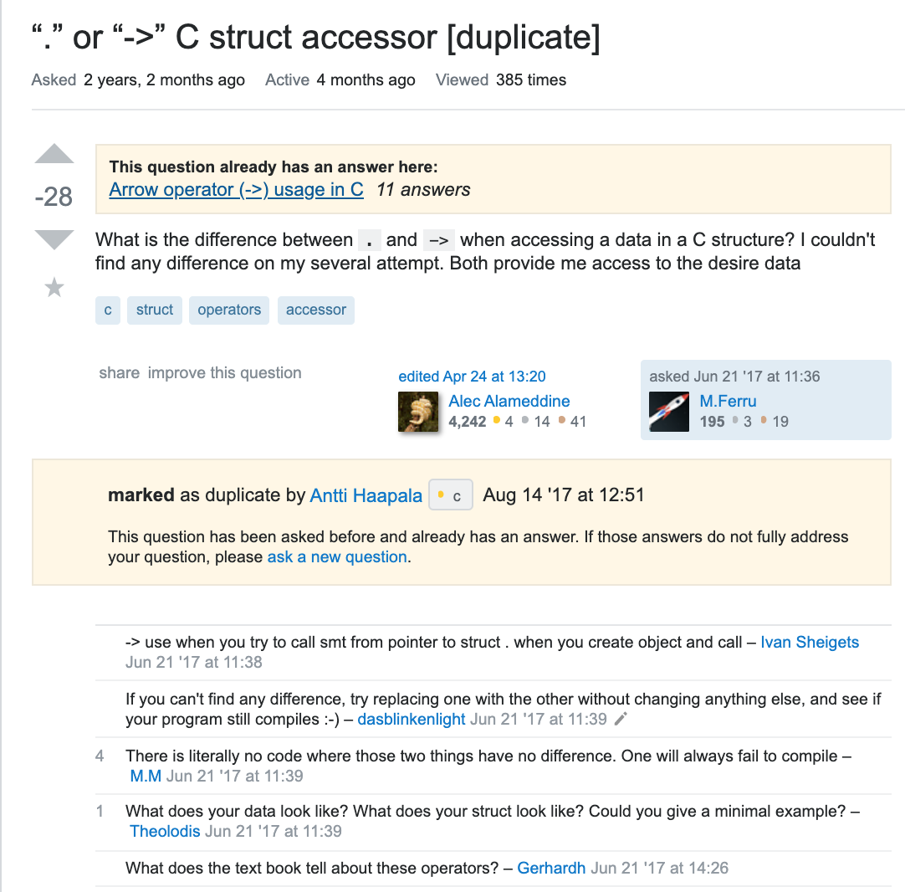
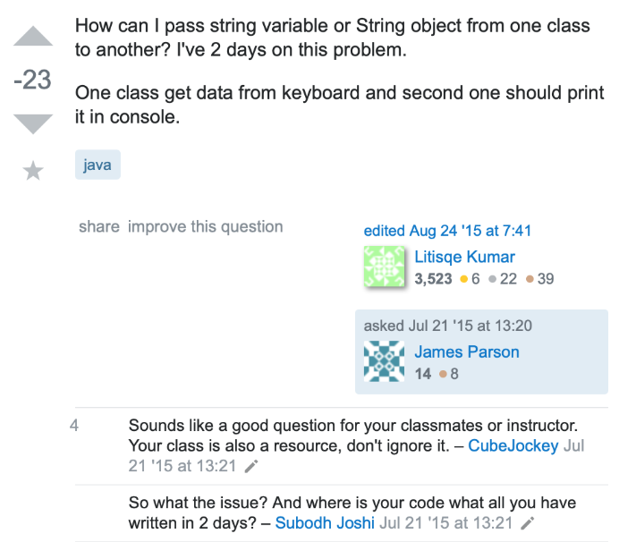

# Is there such a thing as a stupid question?
There is one sentence many teachers have used over the years to encourage their students to seek help in class and that is "there's no such thing as a stupid question." This I agree with; every question is an effort to understand an aspect of the world. This sentence encourages people to ask questions no matter how silly they think it may be. It is very likely that there are others who may not know the answer to this "stupid question" and are too afraid to ask. The person asking the question not only helps themselves, but also those who are also confused. Though lets not say there are no ill formatted questions.

Eric Raymond's essay [How To Ask Questions The Smart Way](http://www.catb.org/esr/faqs/smart-questions.html) provides a guideline on how to ask smart questions and be efficient with not only your time, but other programmers or "hackers" as well.

# A Smart Question
[Here](https://stackoverflow.com/questions/11227809/why-is-processing-a-sorted-array-faster-than-processing-an-unsorted-array) is an example of a smart question. This developer is confused as to why a sorted array processes faster than an unsorted array. Not only did he make sure he was right by testing it in two different languages, but he also provides the codes so others can test it out. The title is appropriate and informative. This question is favorited by a high number of people and has an even higher number of people up-voting it. It can be seen by the many lengthy explanations containing many visual help, that it was received as a good question.
# A Bad Question

[Here](https://stackoverflow.com/questions/44674997/or-c-struct-accessor) is an example of a bad question. This person wants to know the difference between . and -> when accessing data in C.
This person says he has made several attempts and have found no difference between the two, but provides no code to prove this. Someone basically called this person a liar by saying there is no code where there are no differences as one would fail to compile. Another is grasping for more information, asking for an example and data.
Notice that there is a link for another much older question asking the same thing. Therefore, it is a common question and this person did not try to find his answer by searching the web or using his resources. To test this, I google searched ". vs -> in c" and on of the results on the first page is another [stackoverflow question](https://stackoverflow.com/questions/10036381/arrow-operator-vs-dot-operator) that again asks for the same thing, except it is asked in a smart way. This other developer provides a code snippet and it is obvious he did some research.

[Here](https://stackoverflow.com/questions/31540225/passing-string-from-one-class-to-another) is another poorly asked question. The one question in this post is "How can I pass string variable or sting object from one class to another?" This question is confusing because string variable and string object is not the same thing. The rest of the post does not help to clarify. This person does not provide any code, so it seems like this person didn't actually try to work it out at all, which is what the second comment seems to be implying. Without the code, others can’t help him fix it and it seems as if he wants others to do all the work. In Eric Raymands essay, he says not to post homework questions, from the first comment we can see that people have easily spotted it as a homework problem and directed him to his professor or class.

# Final Thoughts
Being able to ask "smart questions" is very important in software engineering. Software is continuously evolving and improving, so much so that there may not be updated textbooks or helpful educational sites for new things. Also, sometimes just reading a book is not a very good way of learning something new. To keep up with software, developers must be able to communicate efficiently and effectively with each other. When making big projects, a software engineer will most likely work in a team. It would be more efficient to ask a smart question and get a quick reply, than to converse back and forth just because not enough information was provided. It is enjoyable to help others understand something that fascinates you and something you've worked so hard on, but like Eric Raymond said, no one would want to waste their time on people who aren't participating in finding a solution. There is no such thing as a stupid question, just poorly made ones. For the best results, use the guidelines discussed in Eric Raymons's essay.

  
Gaining Access

  
Inviting Friends

  

    
Benefits

    

      <a class="item" href="#">Link to somewhere</a>
      
Rebates

      
Discounts

    

  

  
Warranty

