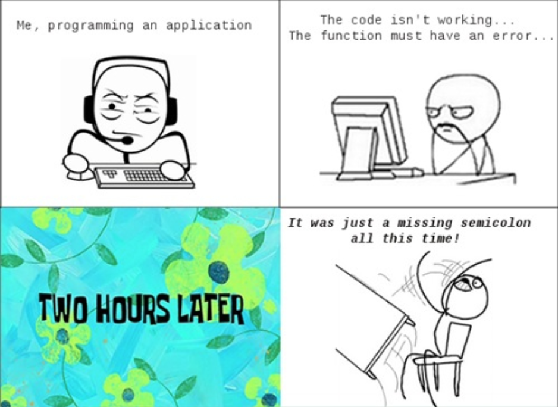

Remember 

# My Experience

#Why are Coding Standards Important

 Coding standards benefit everyone. Think of a text, would you rather read one extremely long paragraph or multiple small paragraphs? Coding with coding standards make your code more appealing and easy to read. It would be easily maintained, updated, and debugged. Most importantly, others would be able to understand your code. Some codes aren't only going to be yours. Whether you are working in a group or passing your code to someone else to work on, it is very important to use coding standards so others can understand your work. Coding standards result in code that is efficient in both time and cost. If you want your code to be praised, use coding standards.
