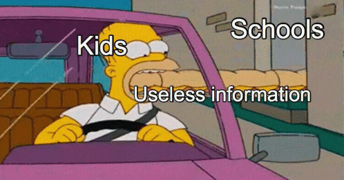
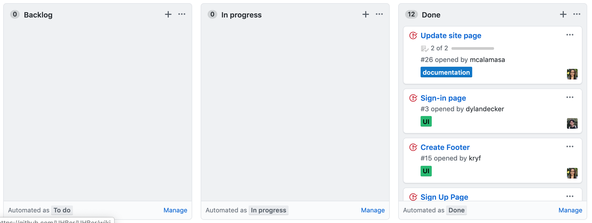

Technology is always evolving and improving, so it would only make sense not to only learn how to use a specific language, developing tool, etc., as new and better things will be invented and your knowledge may become irrelevant. It is important to learn concepts that will help you adapt and learn new languages, developing tools, etc.

Out of all the classes I have had in my college years, ICS 314 has been one of the most stressful and demanding class I've had. And I actually kind of enjoyed it. I have learned many fundamental software engineering concepts. ICS 314 is designed for web application development, but many of the concepts taught go beyond web application development such as coding standards, smart questions, and agile project management. This class taught me things that go beyond the classroom and into real life.

# Coding Standards
A coding standard is a set of rules or guidelines to follow when programming. Coding standards preserve organization. For example, having a place for your belongings keeps your room in order. Once you become too lazy to put one or two items back in their place, you won't be putting anything back in its place. You'll end up losing track of your things and end up with a chaotic mess. Not having guidelines in the first place is even worse. This is just like coding.
Although I learned about coding standards in a web application development class, I consider coding standards a necessity for any coding. In fact, I wish I learned about them sooner, because using one in my other coding classes would have saved me a lot of time and stress.
Using coding standards make code more appealing and easier to read and understand. It would be easily maintained, updated, and debugged. As Martin Fowler said, "Any fool can write code that a computer can understand. Good programmers write code that humans can understand."

# Smart Questions
In ICS 314 we learned about open source software development
which means the source code for the project is open to the public for others to use and for developers to improve. With so many developers contributing to these source codes, starting to first use it and understand the code can be very intimidating, confusing, and you are more likely than not going to face problems. Thus, it is important to ask smart questions.

Asking smart questions improves the probability of getting useful answers. Asking smart questions entail sample code so others can replicate the problem, an explanation on the efforts done to solve it to show there was effort made, and a good explanation on what exactly the problem is. Also, the question has to be on the forum as others will ignore or be hostile otherwise. Being able to ask smart questions will useful in just about anything.

# Agile Project Management
Being able to work in a team is so important that schools start teaching team work as early as elementary school. Project management structures the work to be done in a way that maximizes parallelism. This means making sure everyone on the team is working and making advancements at the same time. Agile project management is a form of project management where large projects are broken into smaller more manager tasks. These tasks are done quickly enabling the team to adapt to change and deliver quickly. Each release has a deadline and delivers functionality. In ICS 314, we used issue driven project management for our final project.

Issue driven project management is a type of agile project management where the project is divided into milestones and milestones are considered done at the deadline, not when a set of issues are completed. For this type of management, we used automated Kanban boards. Each team member has exactly one issue assigned to them in the in progress section. There are always tasks in the back log for a member to work on when their current issue is done. Finally, when an issue is completed and closed , it automatically moves to the done section.
Issue driven project management can be used in many projects that consist of a small team. It is best for projects that start with a base and are then added to. I could have used it for my EE296 project where we had to make a micro-mouse that searched for a way out of a maze. This project management would have prevented procrastination and encouraged us to actually do work since it is broken into small, easy, and fast to do tasks.

# Overall Thoughts
ICS 314 is a very important class that teaches web application development in a way that also teaches valuable techniques that will help me in my computer engineering career. Coding standards will keep my codes clean and easy to debug, asking smart questions will help me learn new concepts from fellow programmers, and agile project management will make team projects more bearable, less intimidating, and overall successful. ICS 314 taught me important concepts that I will be using to keep up with technology advancements and as they say, "keep up with the times".
