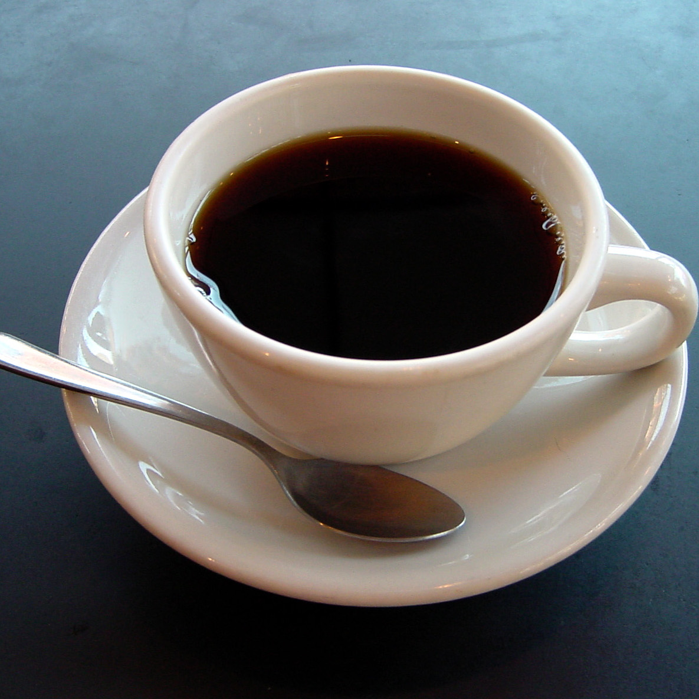

Overtime restaurants and shops have made applications that allow their customers to view and shop for their items. My café does just that, but for an imaginary café and it communicates with the user using text. It is implemented with object oriented programming and runs on terminal.
  

The user is able to see the menu and make an order. To replicate ordering from an actual café, the user can add or omit ingredients and is provided with a receipt containing the specifics and prices of their order. 
  
My team decided to use a divide and conquer technique. I learned to organize and adjust my code to be able to run with the rest of the team’s code. Although we were working on different parts, we met regularly to discuss problems and bounce ideas off each other. I was in charge of programming the user information. The user is either a customer or an owner of the café. The user is able to do things depending on which type they are.
