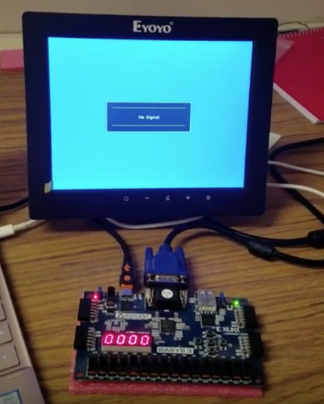

My team and I created a pong game by using a Basys3 board as our FPGA and a small monitor to show the graphics. We used Xilinx vivado to program the board and the monitor in verilog.
  
Pong is a one player ping pong game. Instead of bouncing the ball from one player to another, the user bounces the ball against the walls and prevents it from passing the bar. Of course, the game would be a bit boring if a doesn't get harder, so after the players score reaches 100, the ball gets faster, and again at 300.

We did a lot of research and small side projects just to understand the basic workings of a monitor. We went through a lot of trial and error, and spent a lot of time wondering why it wouldn't behave the way it ought to. I learned the great importance of physical team meetings, not only to make sure we're all working on the project, but also for better communication. I also got more familiar with verilog and programming a board/hardware. 

