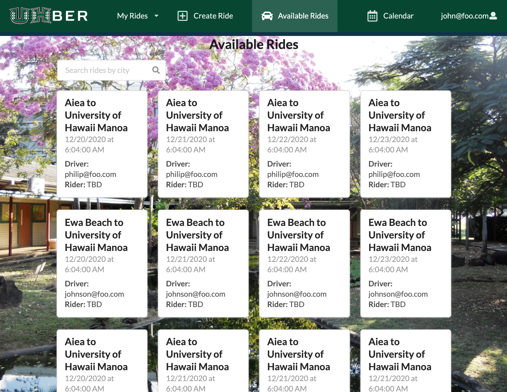

Many UH Manoa students commute to school from other parts of the island and unfortunately Manoa is in Honolulu, which according to this <a href="https://www.hawaiinewsnow.com/2019/02/13/new-report-says-honolulus-traffic-is-pretty-bad-its-not-worst/">news article</a> is the 18th most congested and worst city for traffic in the United States. I too commute to school every morning and if I leave between 6:30am and 8:00 it takes me about an hour to get to school.
Then I also have to deal with traffic on the way home. This takes a big chunk of my money, gas, and with a lot of people commuting everyday it is very bad for the environment. My team and I made UHber to help UH Manoa students save money, energy, and time (by enabling them to use the express and carpool lanes). On a larger scale, UHber helps the environment by decreasing the amount of daily drivers.

A user can create an account and a profile. Once logged in a user can see the list of available rides. The rides on this page were created by other users who are offering to drive another student either to UH Manoa from a specific city or from UH Manoa to their home city. They also don't have a rider yet. The user can also offer a ride. Finally, the user can see when they are planned to drive someone and when they are riding with someone else.

This app is far from being a finished product. There are many other functionalities my team and I want to implement before we think students will actually use it. To make things fair, we thought of a points system where points are a form of in app currency, so users have to provide rides as well as take rides. We also thought about using a calendar to better organize the user’s rides.

An agile project management to maximize parallelism by ensuring that everyone on the team is making progress at the same time. For this project we used an issue driven project management, which is a type of agile project management where the project was broken into three milestones that had set due dates. When each milestone was done, UHber had to have been deployed and have more functionality than when it was deployed from the previous milestone. For each milestone we would first create at least four issues, one for each team member and one in back log. We used an automated Kanban boards to keep track of our issues. I learned that only working functionalities should be deployed and not unfinished ones, so users don't think something is wrong with your web application.

My main contribution to UHber are the functionalities that deal with the rides. I made the ride cards, default rides, and default accounts to use them as riders and drivers in the default rides. I also made all the pages that shows different variations of ride lists. I made the available rides page to enable users to filter the list by cities.

In an earlier milestone I made the sign up page. I've deployed UHber and updated the organization page for one of the milestones.

I came out of this project appreciating agile project management. With set deadlines and mini presentations for each milestone, we were forced to work on the project continuously instead of procrastinating and waiting until a couple of days before the project was due to start working on it. It also greatly decreased the amount of merge conflicts as we knew what each person was doing and hardly changed the same files at the same time. If there were merge conflicts, they were easy to resolve. I used to think it was near impossible to work on the same code as others at the same time, but with agile project management, we were able to add to the project at the same time.

Visit UHber <a href="http://uhber.meteorapp.com/#/">here.</a>
See the source codes at <a href="https://github.com/UHBer/"><i class="large github icon"/>UHber's Organization GitHub Pages
