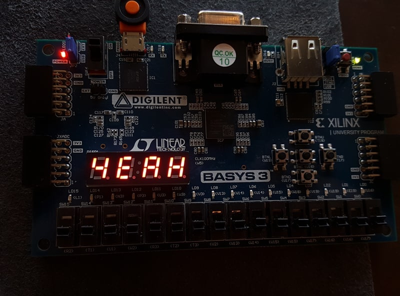

My team and I created a simplified version of the very popular Simon says game. It is simplified in the sense of only having two lights instead of four and the game only goes on until the user gets to a sequence of 8 as opposed to going on until the user loses. We used a state machine to control the different components.

An 8-bit binary sequence is randomly generated. First, either the left or right LED flashes depending on the first number of the random sequence. Next, it is the user's turn to press the button that corresponds the light that flashed. If the user is correct, the board will flash the the first bit, then the second. Again, the user must replicate it, and so on until either the user inputs the wrong sequence or the user got to all 8 bits. Finally, the four seven segment LED's will display "LOSE" or "YEAH".

Before this project I did have prior knowledge of Verilog, but this project made me realize that programming hard ware is not the same as software. In hardware you have to store the results of components in registers and make sure the timing is right.
